# 🤗 Wallet API Gateway

The API Gateway is the edge service for the wallet platform. It receives external HTTP traffic, applies perimeter controls, enriches trusted requests with user context, and proxies approved traffic to the Wallet Service.

This project is built on Spring Boot 3.5.14, Spring Cloud Gateway WebFlux, Reactive Redis, JJWT, Resilience4j, Actuator, and Springdoc OpenAPI.

## 🐵 Entire Project Visibility at One Glance

This is the complete project map in one diagram. It connects repository files to Spring Boot startup, runtime request flow, Redis state, Wallet Service proxying, fallbacks, Docker image delivery, and quality workflows.

```mermaid
%%{init: {"theme": "base", "flowchart": {"htmlLabels": true, "nodeSpacing": 180, "rankSpacing": 220, "diagramPadding": 80, "curve": "basis", "wrappingWidth": 760}, "themeVariables": {"fontSize": "100px", "fontFamily": "Inter, Arial, sans-serif", "lineColor": "#495057"}} }%%
flowchart LR
    subgraph repo["Repository"]
        direction TB
        repoWidth["&nbsp;&nbsp;&nbsp;&nbsp;&nbsp;&nbsp;&nbsp;&nbsp;&nbsp;&nbsp;&nbsp;&nbsp;&nbsp;&nbsp;&nbsp;&nbsp;&nbsp;&nbsp;&nbsp;&nbsp;&nbsp;&nbsp;&nbsp;&nbsp;&nbsp;&nbsp;&nbsp;&nbsp;&nbsp;&nbsp;&nbsp;&nbsp;&nbsp;&nbsp;&nbsp;&nbsp;&nbsp;&nbsp;&nbsp;&nbsp;&nbsp;&nbsp;&nbsp;&nbsp;&nbsp;&nbsp;&nbsp;&nbsp;&nbsp;&nbsp;&nbsp;&nbsp;&nbsp;&nbsp;&nbsp;&nbsp;&nbsp;&nbsp;&nbsp;&nbsp;"]
        pom["pom.xml<br/>Java 21, Spring Boot 3.5.14,<br/>Spring Cloud 2025.0.2,<br/>Gateway WebFlux, Reactive Redis,<br/>JJWT, Resilience4j, Springdoc, Actuator"]
        appYaml["application.yaml<br/>base routes, default filters,<br/>Redis host, JWT secret binding,<br/>Springdoc, circuit breaker ids"]
        prodYaml["application-prod.yaml<br/>env-driven Redis and Wallet URL,<br/>Redis SSL, production rate limits"]
        lua["scripts/token_bucket.lua<br/>atomic Redis token bucket"]
        mainClass["ApGatewayApplication.java<br/>Spring Boot entrypoint"]
        filters["filter package<br/>RouteValidator<br/>CustomLuaRateLimiterFilter<br/>AuthenticationFilter"]
        config["config package<br/>CorsConfig<br/>RateLimitProperties<br/>ResilienceConfig"]
        controllers["controller package<br/>GatewayInfoController<br/>FallbackController"]
        util["util package<br/>JwtUtil"]
        test["ApIgatewayApplicationTests.java<br/>context load test"]
        docker["Dockerfile<br/>Maven builder to Java 21 distroless runtime"]
        ci["GitHub Actions<br/>api-gateway-ci.yml<br/>qodana_code_quality.yml"]
        qodanaConfig["qodana.yaml<br/>Qodana JVM linter config<br/>projectJDK 21"]
        qodanaSarif["qodana.sarif.json<br/>Qodana SARIF baseline/report artifact"]
    end

    subgraph boot["Application Boot"]
        direction TB
        bootWidth["&nbsp;&nbsp;&nbsp;&nbsp;&nbsp;&nbsp;&nbsp;&nbsp;&nbsp;&nbsp;&nbsp;&nbsp;&nbsp;&nbsp;&nbsp;&nbsp;&nbsp;&nbsp;&nbsp;&nbsp;&nbsp;&nbsp;&nbsp;&nbsp;&nbsp;&nbsp;&nbsp;&nbsp;&nbsp;&nbsp;&nbsp;&nbsp;&nbsp;&nbsp;&nbsp;&nbsp;&nbsp;&nbsp;&nbsp;&nbsp;&nbsp;&nbsp;&nbsp;&nbsp;&nbsp;&nbsp;&nbsp;&nbsp;&nbsp;&nbsp;&nbsp;&nbsp;&nbsp;&nbsp;&nbsp;&nbsp;&nbsp;&nbsp;&nbsp;&nbsp;"]
        bootStart["JVM starts api-gateway.jar"]
        spring["Spring Boot autoconfiguration"]
        webflux["Reactive WebFlux runtime<br/>non-blocking request pipeline"]
        routeTable["Gateway route table<br/>7 Wallet Service routes"]
        beans["Managed beans<br/>filters, controllers,<br/>Redis template, circuit breaker,<br/>JWT utility"]
    end

    subgraph runtime["Runtime Traffic"]
        direction TB
        client["Client / UI / Partner"]
        root["GET /<br/>gateway status JSON"]
        swagger["GET /swagger-ui.html<br/>gateway-hosted Swagger UI"]
        incoming["Incoming API request"]
        routeMatch{"Path predicate match"}
        authRoute["/api/v1/auth/**"]
        paymentRoute["/api/v1/payments/**"]
        walletRoute["/api/v1/wallets/**"]
        adminMessagingRoute["/api/v1/admin/messaging/**"]
        adminUsersRoute["/api/v1/admin/users/**"]
        webhookRoute["/api/v1/webhooks/**"]
        openApiRoute["/wallet-service/v3/api-docs/**"]
        rateLimit{"CustomLuaRateLimiterFilter<br/>configured on route?"}
        authFilter{"AuthenticationFilter<br/>configured and secured?"}
        cb["CircuitBreaker filter<br/>walletServiceCircuitBreaker"]
        strip["StripPrefix=1<br/>for OpenAPI proxy"]
    end

    subgraph security["Security and State"]
        direction TB
        securityWidth["&nbsp;&nbsp;&nbsp;&nbsp;&nbsp;&nbsp;&nbsp;&nbsp;&nbsp;&nbsp;&nbsp;&nbsp;&nbsp;&nbsp;&nbsp;&nbsp;&nbsp;&nbsp;&nbsp;&nbsp;&nbsp;&nbsp;&nbsp;&nbsp;&nbsp;&nbsp;&nbsp;&nbsp;&nbsp;&nbsp;&nbsp;&nbsp;&nbsp;&nbsp;&nbsp;&nbsp;&nbsp;&nbsp;&nbsp;&nbsp;&nbsp;&nbsp;&nbsp;&nbsp;&nbsp;&nbsp;&nbsp;&nbsp;&nbsp;&nbsp;&nbsp;&nbsp;&nbsp;&nbsp;&nbsp;&nbsp;&nbsp;&nbsp;&nbsp;&nbsp;"]
        routeValidator["RouteValidator<br/>public fragments<br/>teardown route exception<br/>OPTIONS bypass support"]
        redis[("Redis reactive state store<br/>rate_limit:* token buckets<br/>blacklist:* revoked tokens<br/>TTL-backed cleanup")]
        jwt["JwtUtil<br/>verify HMAC JWT signature<br/>extract subject as user id<br/>extract ownerType as role"]
        headers["Request mutation<br/>X-User-Id identity header<br/>X-User-Role role header<br/>X-Gateway-Token internal trust header"]
        reject401["401 Unauthorized<br/>missing, invalid, expired,<br/>or blacklisted JWT"]
        reject429["429 Too Many Requests<br/>Redis Lua token bucket<br/>request rejected at edge"]
    end

    subgraph downstream["Downstream and Fallback"]
        direction TB
        downstreamWidth["&nbsp;&nbsp;&nbsp;&nbsp;&nbsp;&nbsp;&nbsp;&nbsp;&nbsp;&nbsp;&nbsp;&nbsp;&nbsp;&nbsp;&nbsp;&nbsp;&nbsp;&nbsp;&nbsp;&nbsp;&nbsp;&nbsp;&nbsp;&nbsp;&nbsp;&nbsp;&nbsp;&nbsp;&nbsp;&nbsp;&nbsp;&nbsp;&nbsp;&nbsp;&nbsp;&nbsp;&nbsp;&nbsp;&nbsp;&nbsp;&nbsp;&nbsp;&nbsp;&nbsp;&nbsp;&nbsp;&nbsp;&nbsp;&nbsp;&nbsp;&nbsp;&nbsp;&nbsp;&nbsp;&nbsp;&nbsp;&nbsp;&nbsp;&nbsp;&nbsp;"]
        walletService["Wallet Service<br/>default internal port 8081<br/>receives validated identity headers<br/>owns wallet-domain behavior"]
        walletDocs["Wallet Service OpenAPI<br/>/v3/api-docs<br/>proxied through gateway namespace<br/>/wallet-service/v3/api-docs"]
        fallback["/fallback/walletService<br/>503 Service Unavailable<br/>controlled degradation JSON<br/>used by circuit breaker"]
        response["Final client response<br/>downstream payload,<br/>edge rejection,<br/>or fallback body"]
    end

    subgraph delivery["Build and Delivery"]
        direction TB
        deliveryWidth["&nbsp;&nbsp;&nbsp;&nbsp;&nbsp;&nbsp;&nbsp;&nbsp;&nbsp;&nbsp;&nbsp;&nbsp;&nbsp;&nbsp;&nbsp;&nbsp;&nbsp;&nbsp;&nbsp;&nbsp;&nbsp;&nbsp;&nbsp;&nbsp;&nbsp;&nbsp;&nbsp;&nbsp;&nbsp;&nbsp;&nbsp;&nbsp;&nbsp;&nbsp;&nbsp;&nbsp;&nbsp;&nbsp;&nbsp;&nbsp;&nbsp;&nbsp;&nbsp;&nbsp;&nbsp;&nbsp;&nbsp;&nbsp;&nbsp;&nbsp;&nbsp;&nbsp;&nbsp;&nbsp;&nbsp;&nbsp;&nbsp;&nbsp;&nbsp;&nbsp;"]
        maven["Maven build pipeline<br/>mvn clean package<br/>APIgateway-0.0.1-SNAPSHOT.jar<br/>Java 21 artifact"]
        image["Distroless runtime image<br/>wallet-api-gateway<br/>latest tag<br/>github.sha immutable tag"]
        dockerHub["Docker Hub registry<br/>pushed production images<br/>registry build cache<br/>deployment source"]
        qodana["Qodana quality scan<br/>pull requests<br/>manual workflow dispatch<br/>production branch push"]
    end

    pom --> spring
    appYaml --> spring
    prodYaml --> spring
    mainClass --> bootStart
    filters --> beans
    config --> beans
    controllers --> beans
    util --> beans
    lua --> beans
    bootStart --> spring
    spring --> webflux
    spring --> routeTable
    spring --> beans

    client --> root
    client --> swagger
    client --> incoming
    root --> controllers
    swagger --> openApiRoute
    incoming --> routeMatch
    routeMatch --> authRoute
    routeMatch --> paymentRoute
    routeMatch --> walletRoute
    routeMatch --> adminMessagingRoute
    routeMatch --> adminUsersRoute
    routeMatch --> webhookRoute
    routeMatch --> openApiRoute

    authRoute --> rateLimit
    paymentRoute --> rateLimit
    walletRoute --> rateLimit
    adminMessagingRoute --> rateLimit
    adminUsersRoute --> rateLimit
    webhookRoute --> cb
    openApiRoute --> strip
    strip --> cb

    rateLimit -->|"Redis Lua allowed"| authFilter
    rateLimit -->|"Redis Lua denied"| reject429
    rateLimit --> redis
    authFilter --> routeValidator
    routeValidator -->|"public path"| cb
    routeValidator -->|"secured path"| redis
    redis -->|"blacklist miss"| jwt
    redis -->|"blacklist hit"| reject401
    jwt -->|"valid claims"| headers
    jwt -->|"invalid token"| reject401
    headers --> cb
    cb -->|"healthy downstream"| walletService
    cb -->|"timeout, failure, open circuit"| fallback
    walletService --> response
    walletDocs --> response
    fallback --> response
    reject401 --> response
    reject429 --> response

    docker --> maven
    test --> maven
    ci --> maven
    ci --> qodana
    qodanaConfig --> qodana
    qodanaSarif --> qodana
    maven --> image
    image --> dockerHub

    classDef repoNode fill:#f8f9fa,stroke:#6c757d,stroke-width:5px,color:#212529,font-size:100px;
    classDef bootNode fill:#e8f3ff,stroke:#2271b1,stroke-width:5px,color:#0b3558,font-size:100px;
    classDef runtimeNode fill:#fff4e6,stroke:#d9822b,stroke-width:5px,color:#5f2b00,font-size:100px;
    classDef securityNode fill:#f3e8ff,stroke:#7b2cbf,stroke-width:5px,color:#35115a,font-size:100px;
    classDef downstreamNode fill:#ecfdf3,stroke:#2f9e44,stroke-width:5px,color:#123b1f,font-size:100px;
    classDef deliveryNode fill:#fff0f6,stroke:#c2255c,stroke-width:5px,color:#5c102c,font-size:100px;
    classDef widthSpacer fill:transparent,stroke:transparent,color:transparent,font-size:100px;
    class pom,appYaml,prodYaml,lua,mainClass,filters,config,controllers,util,test,docker,ci,qodanaConfig,qodanaSarif repoNode;
    class bootStart,spring,webflux,routeTable,beans bootNode;
    class client,root,swagger,incoming,routeMatch,authRoute,paymentRoute,walletRoute,adminMessagingRoute,adminUsersRoute,webhookRoute,openApiRoute,rateLimit,authFilter,cb,strip runtimeNode;
    class routeValidator,redis,jwt,headers,reject401,reject429 securityNode;
    class walletService,walletDocs,fallback,response downstreamNode;
    class maven,image,dockerHub,qodana deliveryNode;
    class repoWidth,bootWidth,securityWidth,downstreamWidth,deliveryWidth widthSpacer;
```

### How The Application Works: Step by Step

1. The repository is built as a Java 21 Maven project using Spring Boot 3.5.14 and Spring Cloud 2025.0.2.
2. `ApGatewayApplication` starts the Spring Boot application and lets auto-configuration assemble the WebFlux gateway runtime.
3. Spring loads `application.yaml` by default and imports `.env` through `optional:file:.env[.properties]`.
4. When `SPRING_PROFILES_ACTIVE=prod` is enabled, `application-prod.yaml` overrides infrastructure values with environment-driven Redis, Wallet Service, Redis SSL, and production rate-limit configuration.
5. The gateway creates route definitions from `spring.cloud.gateway.server.webflux.routes`.
6. Spring registers custom beans: `AuthenticationFilter`, `CustomLuaRateLimiterFilter`, `ClientIpResolver`, `RouteValidator`, `JwtUtil`, `CorsConfig`, `RateLimitProperties`, `ResilienceConfig`, `GatewayInfoController`, and `FallbackController`.
7. The gateway starts listening on Spring Boot's configured port, normally `8080`.
8. A request to `/` is handled inside the gateway by `GatewayInfoController` and returns edge status JSON.
9. A request to `/swagger-ui.html` is handled by Springdoc and configured to load Wallet Service docs through `/wallet-service/v3/api-docs`.
10. A request matching `/wallet-service/v3/api-docs/**` is proxied to Wallet Service after `StripPrefix=1` removes the `/wallet-service` namespace.
11. A business API request enters the Spring Cloud Gateway WebFlux pipeline and is matched against route path predicates.
12. Auth traffic matches `/api/v1/auth/**`; payment traffic matches `/api/v1/payments/**`; wallet-domain traffic matches `/api/v1/wallets/**`; admin messaging traffic matches `/api/v1/admin/messaging/**`; admin user traffic matches `/api/v1/admin/users/**`; webhook traffic matches `/api/v1/webhooks/**`.
13. Routes with `CustomLuaRateLimiterFilter` build a Redis key from the route prefix and client IP.
14. The rate limiter resolves the client IP through `ClientIpResolver`: it trusts `X-Forwarded-For` only when the immediate caller matches a configured trusted proxy or load-balancer source IP or CIDR; otherwise it falls back to `remoteAddress`, then to `unknown`.
15. The rate limiter executes `scripts/token_bucket.lua` in Redis so token refill, consumption, persistence, and TTL update happen atomically.
16. If Redis returns `0`, the gateway stops the request at the edge with HTTP `429` and the body `Try again after some time`.
17. If Redis fails during rate limiting, the filter logs the error and fails open, allowing the request to continue.
18. Routes with `AuthenticationFilter` ask `RouteValidator` whether the path is secured.
19. `RouteValidator` treats `/api/v1/auth/`, `/api/v1/webhooks/`, `/wallet-service/v3/api-docs`, `/v3/api-docs`, `/swagger-ui`, `/swagger-ui.html`, and `/webjars/` as public fragments.
20. `RouteValidator` explicitly makes `/api/v1/auth/logout` and `/api/v1/auth/close-account` secured when the auth filter is present on that route.
21. Secured requests must include an `Authorization` header with a bearer token.
22. `AuthenticationFilter` checks Redis for `blacklist:<token>` before cryptographic validation.
23. If the token is blacklisted, missing, malformed, invalid, or expired outside the allowed teardown path, the gateway returns HTTP `401`.
24. `JwtUtil` verifies the JWT signature using the Base64 `JWT_SECRET` shared with Wallet Service.
25. The gateway extracts the JWT subject as `X-User-Id` and the `ownerType` claim as `X-User-Role`.
26. Logout and close-account requests are treated as teardown routes; the gateway can extract claims from an expired token for graceful teardown.
27. For active teardown tokens, the gateway writes `blacklist:<token> = revoked` to Redis with a TTL equal to the token's remaining lifetime.
28. Gateway default filters add `X-Gateway-Token` to every outbound proxied request and remove duplicate CORS response headers.
29. The request enters the `walletServiceCircuitBreaker` before reaching Wallet Service.
30. If Wallet Service responds within the configured resilience window, the gateway streams the downstream response back to the client.
31. If Wallet Service times out, fails, or the circuit breaker is open, the gateway internally forwards to `/fallback/walletService`.
32. `FallbackController` returns HTTP `503` with a consistent degradation JSON body.
33. Docker builds the project in a Maven Java 21 Alpine builder stage and copies the jar into a non-root Java 21 distroless runtime image.
34. The production CI workflow builds and pushes `wallet-api-gateway:latest` and `wallet-api-gateway:${github.sha}` to Docker Hub, then calls `DEPLOY_WEBHOOK_URL` on pushes to the `production` branch.
35. The Qodana workflow runs code quality analysis on pull requests, manual dispatches, and pushes to `production`.
36. `qodana.yaml` configures the JVM linter for JDK 21, and `qodana.sarif.json` acts as the current SARIF baseline/report artifact.

## 🐵 Table of Contents

- [Entire Project Visibility at One Glance](#entire-project-visibility-at-one-glance)
- [Purpose](#purpose)
- [Architecture at a Glance](#architecture-at-a-glance)
- [Current Project Structure](#current-project-structure)
- [Runtime Flow](#runtime-flow)
- [Route Catalog](#route-catalog)
- [Security Model](#security-model)
- [Rate Limiting Model](#rate-limiting-model)
- [CORS Model](#cors-model)
- [Resilience and Fallbacks](#resilience-and-fallbacks)
- [Configuration Profiles](#configuration-profiles)
- [OpenAPI and Swagger Flow](#openapi-and-swagger-flow)
- [Build, Run, and Test](#build-run-and-test)
- [Docker Runtime](#docker-runtime)
- [CI/CD Pipeline](#cicd-pipeline)
- [Operational Notes](#operational-notes)
- [Suggested Next Improvements](#suggested-next-improvements)

## 🐵 Purpose

The gateway owns the platform edge responsibilities:

- Route external API traffic to the internal Wallet Service.
- Keep public endpoints public while enforcing JWT validation on secured endpoints.
- Add trusted identity headers for downstream services after JWT verification.
- Add the internal `X-Gateway-Token` header to outbound proxied requests.
- Clean duplicate CORS response headers at the gateway edge.
- Reject blacklisted tokens at the edge.
- Blacklist active teardown tokens during logout and close-account flows.
- Rate limit sensitive traffic using a Redis-backed token bucket.
- Protect downstream calls with a Resilience4j circuit breaker and timeout.
- Forward degraded traffic to a consistent fallback response.
- Expose gateway health/status and Swagger UI support.
- Package the service as a small non-root distroless container image.

## 🐵 Architecture at a Glance

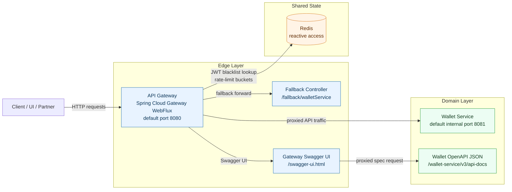

### High-level component responsibilities

| Component              | File                                                                         | Responsibility                                                                                                  |
|------------------------|------------------------------------------------------------------------------|-----------------------------------------------------------------------------------------------------------------|
| Spring Boot entrypoint | `src/main/java/com/wallet/APIgateway/ApGatewayApplication.java`              | Boots the WebFlux gateway application.                                                                          |
| Route configuration    | `src/main/resources/application.yaml`                                        | Base route table, default gateway filters, Redis host, Springdoc config, JWT secret binding, resilience values. |
| Production overrides   | `src/main/resources/application-prod.yaml`                                   | Environment-driven Redis, Wallet Service URL, TLS Redis, trusted proxy CIDRs, and production rate limits.       |
| JWT filter             | `src/main/java/com/wallet/APIgateway/filter/AuthenticationFilter.java`       | Validates bearer tokens, checks Redis blacklist, injects identity headers, blacklists teardown tokens.          |
| Route validator        | `src/main/java/com/wallet/APIgateway/filter/RouteValidator.java`             | Defines public endpoint patterns and forces teardown routes through security when the auth filter is attached.  |
| Custom rate limiter    | `src/main/java/com/wallet/APIgateway/filter/CustomLuaRateLimiterFilter.java` | Executes a Redis Lua token bucket per client IP.                                                                |
| Client IP resolver     | `src/main/java/com/wallet/APIgateway/filter/ClientIpResolver.java`           | Resolves caller IPs safely by trusting `X-Forwarded-For` only from configured proxy source IPs or CIDRs.       |
| CORS config            | `src/main/java/com/wallet/APIgateway/config/CorsConfig.java`                 | Registers the reactive CORS policy for browser clients using configured allowed origins.                        |
| CORS properties        | `src/main/java/com/wallet/APIgateway/config/CorsProperties.java`             | Binds `application.cors.allowed-origins` from `CORS_ALLOWED_ORIGINS`.                                           |
| Rate-limit properties  | `src/main/java/com/wallet/APIgateway/config/RateLimitProperties.java`        | Binds `application.rate-limit.trusted-proxies` so proxy trust rules are configurable per environment.           |
| Lua script             | `src/main/resources/scripts/token_bucket.lua`                                | Performs atomic token bucket read, refill, allow/deny, and TTL update inside Redis.                             |
| Resilience config      | `src/main/java/com/wallet/APIgateway/config/ResilienceConfig.java`           | Configures the reactive Resilience4j circuit breaker and timeout.                                               |
| Gateway info endpoint  | `src/main/java/com/wallet/APIgateway/controller/GatewayInfoController.java`  | Returns root gateway status from `/`.                                                                           |
| Fallback endpoint      | `src/main/java/com/wallet/APIgateway/controller/FallbackController.java`     | Returns a 503 JSON response when Wallet Service is degraded or unavailable.                                     |
| Route behavior tests   | `src/test/java/com/wallet/APIgateway/GatewayRouteBehaviorTest.java`          | Verifies public-route bypass, teardown rejection, header injection, admin messaging security, and fallback behavior with `WebTestClient`. |
| Redis integration tests| `src/test/java/com/wallet/APIgateway/GatewayRedisIntegrationTest.java`       | Verifies Lua rate-limit state and blacklist TTL behavior against Redis with Testcontainers.                     |
| Docker image           | `Dockerfile`                                                                 | Builds with Maven and runs on a non-root Java 21 distroless image.                                              |
| CI/CD workflow         | `.github/workflows/api-gateway-ci.yml`                                       | Builds and pushes Docker images, then calls the production deploy webhook on `production` branch pushes.        |

## 🐵 Current Project Structure

```text
.
|-- Dockerfile
|-- env.example
|-- HELP.md
|-- README.md
|-- mvnw
|-- mvnw.cmd
|-- pom.xml
|-- qodana.yaml
|-- qodana.sarif.json
|-- .github/
|   `-- workflows/
|       |-- api-gateway-ci.yml
|       `-- qodana_code_quality.yml
|-- .mvn/
|   `-- wrapper/
|       `-- maven-wrapper.properties
`-- src/
    |-- main/
    |   |-- java/
    |   |   `-- com/wallet/APIgateway/
    |   |       |-- ApGatewayApplication.java
    |   |       |-- config/
    |   |       |   |-- CorsConfig.java
    |   |       |   |-- CorsProperties.java
    |   |       |   |-- RateLimitProperties.java
    |   |       |   `-- ResilienceConfig.java
    |   |       |-- controller/
    |   |       |   |-- FallbackController.java
    |   |       |   `-- GatewayInfoController.java
    |   |       |-- filter/
    |   |       |   |-- AuthenticationFilter.java
    |   |       |   |-- ClientIpResolver.java
    |   |       |   |-- CustomLuaRateLimiterFilter.java
    |   |       |   `-- RouteValidator.java
    |   |       `-- util/
    |   |           `-- JwtUtil.java
    |   `-- resources/
    |       |-- application.yaml
    |       |-- application-prod.yaml
    |       `-- scripts/
    |           `-- token_bucket.lua
    `-- test/
        `-- java/
            `-- com/wallet/APIgateway/
                |-- ApIgatewayApplicationTests.java
                |-- GatewayRedisIntegrationTest.java
                |-- GatewayRouteBehaviorTest.java
                |-- filter/
                |   `-- ClientIpResolverTest.java
                `-- support/
                    `-- GatewayIntegrationTestSupport.java
```

## 🐵 Runtime Flow

Every routed request goes through the Spring Cloud Gateway route matcher. If a route matches, route-specific filters are applied in the order configured for that profile, then the request is proxied to the Wallet Service.

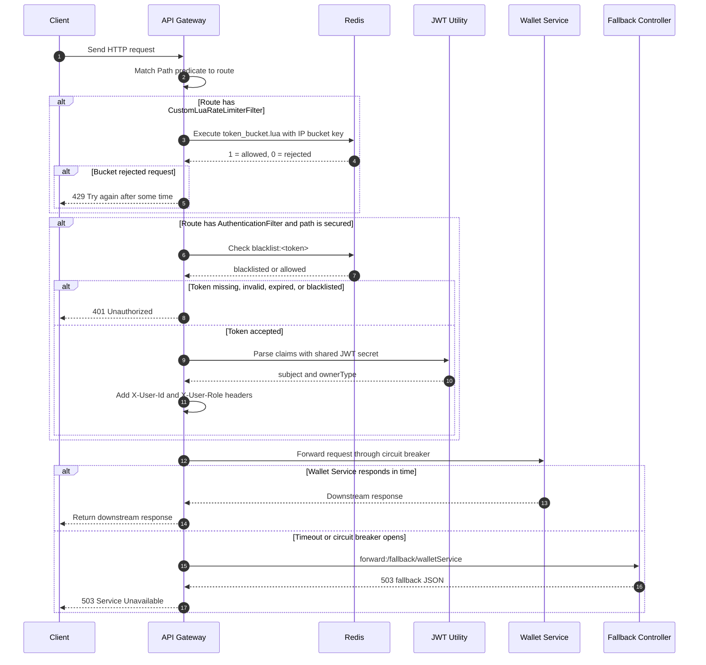

### Filter chain by concern

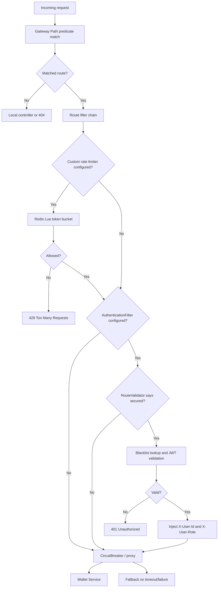

## 🐵 Route Catalog

The active route list is defined under:

```text
spring.cloud.gateway.server.webflux.routes
```

### Base profile routes: `application.yaml`

The base profile points Redis to `wallet-redis-d:6379` and routes Wallet Service traffic through `${WALLET_SERVICE_URL:http://localhost:8081}`.

Default gateway filters:

```yaml
default-filters:
  - AddRequestHeader=X-Gateway-Token, ${GATEWAY_INTERNAL_SECRET:default-edge-secret-string-123}
  - DedupeResponseHeader=Access-Control-Allow-Credentials Access-Control-Allow-Origin
```

| Route ID               | Path predicate                   | Upstream URI                 | Filters                                                                | Behavior                                                                                                                    |
|------------------------|----------------------------------|------------------------------|------------------------------------------------------------------------|-----------------------------------------------------------------------------------------------------------------------------|
| `wallet-auth-route`    | `/api/v1/auth/**`                | `${WALLET_SERVICE_URL:http://localhost:8081}` | `CustomLuaRateLimiterFilter`, `AuthenticationFilter`, `CircuitBreaker` | Auth endpoints are mostly public by `RouteValidator`; logout and close-account become secured when this filter is attached. |
| `wallet-payment-route` | `/api/v1/payments/**`            | `${WALLET_SERVICE_URL:http://localhost:8081}` | `CustomLuaRateLimiterFilter`, `AuthenticationFilter`, `CircuitBreaker` | Secured payment traffic with per-IP rate limiting and fallback protection.                                                  |
| `wallet-domain-route`  | `/api/v1/wallets/**`             | `${WALLET_SERVICE_URL:http://localhost:8081}` | `CustomLuaRateLimiterFilter`, `AuthenticationFilter`, `CircuitBreaker` | Secured wallet-domain traffic with per-IP rate limiting and fallback protection.                                            |
| `wallet-admin-messaging-route` | `/api/v1/admin/messaging/**` | `${WALLET_SERVICE_URL:http://localhost:8081}` | `CustomLuaRateLimiterFilter`, `AuthenticationFilter`, `CircuitBreaker` | Secured admin messaging and Kafka observability traffic. |
| `wallet-admin-users-route` | `/api/v1/admin/users/**` | `${WALLET_SERVICE_URL:http://localhost:8081}` | `CustomLuaRateLimiterFilter`, `AuthenticationFilter`, `CircuitBreaker` | Secured admin user-management traffic. |
| `wallet-webhook-route` | `/api/v1/webhooks/**`            | `${WALLET_SERVICE_URL:http://localhost:8081}` | `CircuitBreaker`                                                       | Webhook ingestion bypasses gateway auth and rate limiting while retaining fallback protection.                              |
| `wallet-openapi-route` | `/wallet-service/v3/api-docs/**` | `${WALLET_SERVICE_URL:http://localhost:8081}` | `CircuitBreaker`, `StripPrefix=1`                                      | Proxies Wallet Service OpenAPI JSON by removing `/wallet-service`.                                                          |

### Production profile routes: `application-prod.yaml`

The production profile uses environment variables for Redis and Wallet Service connectivity. It inherits the default gateway filters from `application.yaml`.

| Route ID               | Path predicate                   | Upstream URI                                       | Filters                                                                | Production limits                 |
|------------------------|----------------------------------|----------------------------------------------------|------------------------------------------------------------------------|-----------------------------------|
| `wallet-auth-route`    | `/api/v1/auth/**`                | `${WALLET_SERVICE_URL:http://wallet-service:8081}` | `CustomLuaRateLimiterFilter`, `AuthenticationFilter`, `CircuitBreaker` | `capacity=10`, `replenishRate=5`  |
| `wallet-payment-route` | `/api/v1/payments/**`            | `${WALLET_SERVICE_URL:http://wallet-service:8081}` | `AuthenticationFilter`, `CustomLuaRateLimiterFilter`, `CircuitBreaker` | `capacity=5`, `replenishRate=2`   |
| `wallet-domain-route`  | `/api/v1/wallets/**`             | `${WALLET_SERVICE_URL:http://wallet-service:8081}` | `AuthenticationFilter`, `CustomLuaRateLimiterFilter`, `CircuitBreaker` | `capacity=15`, `replenishRate=5`  |
| `wallet-admin-messaging-route` | `/api/v1/admin/messaging/**` | `${WALLET_SERVICE_URL:http://wallet-service:8081}` | `CustomLuaRateLimiterFilter`, `AuthenticationFilter`, `CircuitBreaker` | `capacity=10`, `replenishRate=3`  |
| `wallet-admin-users-route` | `/api/v1/admin/users/**` | `${WALLET_SERVICE_URL:http://wallet-service:8081}` | `CustomLuaRateLimiterFilter`, `AuthenticationFilter`, `CircuitBreaker` | `capacity=20`, `replenishRate=5`  |
| `wallet-webhook-route` | `/api/v1/webhooks/**`            | `${WALLET_SERVICE_URL:http://wallet-service:8081}` | `CircuitBreaker`                                                       | No gateway auth or rate limiting. |
| `wallet-openapi-route` | `/wallet-service/v3/api-docs/**` | `${WALLET_SERVICE_URL:http://wallet-service:8081}` | `CircuitBreaker`, `StripPrefix=1`                                      | No rate limiting.                 |


### Local gateway-owned endpoints

| Endpoint                  | Controller              | Response                                                                           |
|---------------------------|-------------------------|------------------------------------------------------------------------------------|
| `/`                       | `GatewayInfoController` | JSON status containing `gateway`, `status`, `perimeter_security`, and `timestamp`. |
| `/fallback/walletService` | `FallbackController`    | HTTP 503 with `success=false`, degradation message, and `SERVICE_UNAVAILABLE`.     |
| `/swagger-ui.html`        | Springdoc               | Swagger UI hosted by the gateway.                                                  |

## 🐵 Security Model

### Public vs secured paths

`RouteValidator` treats these endpoint fragments as public:

```text
/api/v1/auth/
/api/v1/webhooks/
/wallet-service/v3/api-docs
/v3/api-docs
/swagger-ui
/swagger-ui.html
/webjars/
```

There is one explicit exception: when `AuthenticationFilter` is present on the matched route, paths containing `/api/v1/auth/logout` or `/api/v1/auth/close-account` are forced to be secured.

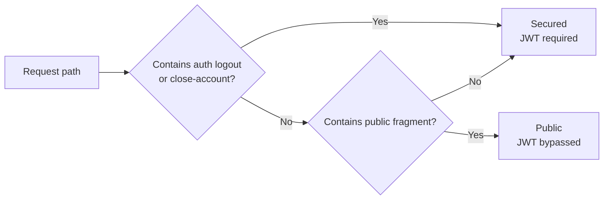

### JWT validation flow

`AuthenticationFilter` validates requests only when `RouteValidator.isSecured` returns true.

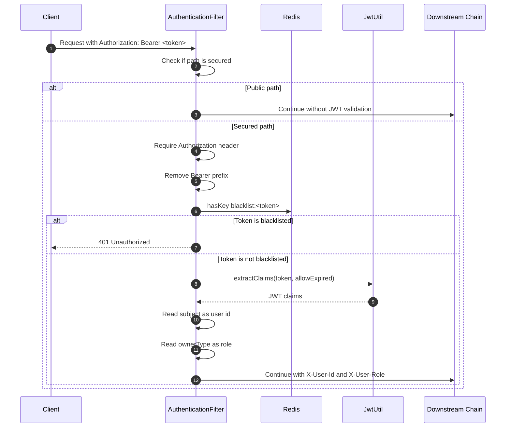

### Identity headers injected downstream

After a secured JWT is accepted, the gateway mutates the request and adds:

| Header        | Source claim        | Purpose                                                     |
|---------------|---------------------|-------------------------------------------------------------|
| `X-User-Id`   | JWT `sub` / subject | Lets Wallet Service know the authenticated principal.       |
| `X-User-Role` | JWT `ownerType`     | Lets Wallet Service receive the owner type or role context. |

The gateway validates identity but does not implement fine-grained authorization decisions. Wallet Service enforces domain-specific permissions.

### JWT secret contract

`JwtUtil` reads the signing secret from:

```text
application.security.jwt.secret-key=${JWT_SECRET}
```

The secret is `Base64` encoded and has a strict match with the secret used by Wallet Service. The gateway uses JJWT to verify signed claims with an HMAC key derived from this secret.

### Token blacklist and teardown behavior

Redis stores revoked tokens under this key pattern:

```text
blacklist:<token>
```

Logout and close-account flows are treated as graceful teardown routes by `AuthenticationFilter`:

- `path.contains("/logout")`
- `path.contains("/close-account")`

For these paths, `JwtUtil.extractClaims(token, true)` allows claims to be salvaged from an expired JWT so the downstream service can still process a graceful teardown when appropriate. If the token still has time remaining, the gateway stores it in Redis with a TTL equal to the remaining token lifetime.

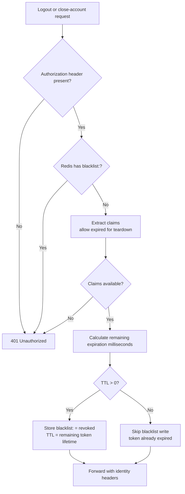

## 🐵 Rate Limiting Model

The active and only supported route-level rate limiter in this project is `CustomLuaRateLimiterFilter`, not Spring Cloud Gateway's built-in `RequestRateLimiter`.

The gateway does not wire a `KeyResolver` bean for built-in rate limiting. Client identification is owned by `ClientIpResolver`, which keeps the active rate-limit path explicit and avoids maintaining two competing mechanisms.

### How the custom filter identifies a caller

`ClientIpResolver` chooses the bucket key in this order:

1. If `X-Forwarded-For` is present and the immediate caller IP is in `application.rate-limit.trusted-proxies`, use the first forwarded IP.
2. Otherwise use `request.getRemoteAddress().getAddress().getHostAddress()`, if available.
3. Otherwise use `unknown`.

Supported trusted proxy entries can be exact IPs or CIDRs, for example:

```text
127.0.0.1/32
10.0.0.0/8
203.0.113.10
```

Configuration source:

```text
application.rate-limit.trusted-proxies=${TRUSTED_PROXY_CIDRS:}
```

If the gateway is directly internet-facing and no trusted reverse proxy sits in front of it, leave `TRUSTED_PROXY_CIDRS` empty so client-supplied `X-Forwarded-For` is ignored.

Final Redis key shape:

```text
<configured keyPrefix><resolved client ip>
```

Examples:

```text
rate_limit:auth:203.0.113.10
rate_limit:payments:203.0.113.10
rate_limit:wallets:203.0.113.10
rate_limit:admin_messaging:203.0.113.10
rate_limit:admin_users:203.0.113.10
```

### Lua token bucket internals

`src/main/resources/scripts/token_bucket.lua` keeps rate limiting atomic inside Redis.

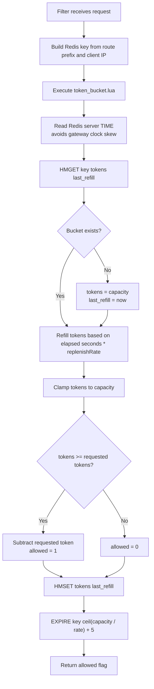

### Route limits

| Profile | Route    | Key prefix             | Capacity | Replenish rate |
|---------|----------|------------------------|----------|----------------|
| Base    | Auth     | `rate_limit:auth:`     | 3        | 1 token/sec    |
| Base    | Payments | `rate_limit:payments:` | 3        | 1 token/sec    |
| Base    | Wallets  | `rate_limit:wallets:`  | 3        | 1 token/sec    |
| Base    | Admin messaging | `rate_limit:admin_messaging:` | 10 | 3 tokens/sec |
| Base    | Admin users | `rate_limit:admin_users:` | 20 | 5 tokens/sec |
| Prod    | Auth     | `rate_limit:auth:`     | 10       | 5 tokens/sec   |
| Prod    | Payments | `rate_limit:payments:` | 5        | 2 tokens/sec   |
| Prod    | Wallets  | `rate_limit:wallets:`  | 15       | 5 tokens/sec   |
| Prod    | Admin messaging | `rate_limit:admin_messaging:` | 10 | 3 tokens/sec |
| Prod    | Admin users | `rate_limit:admin_users:` | 20 | 5 tokens/sec |

### Rate-limit failure behavior

If Redis or Lua execution fails, the gateway uses a fail-open strategy:

```text
Rate limiter failed -> log warning -> allow request to continue
```

That protects platform availability, but it means Redis outages temporarily disable gateway rate limiting.

## 🐵 CORS Model

`CorsConfig` registers a reactive CORS policy for all gateway paths. Origins are bound from `application.cors.allowed-origins`, which maps to `CORS_ALLOWED_ORIGINS`.

| Setting | Value |
|---------|-------|
| Base allowed origins | `${CORS_ALLOWED_ORIGINS:http://localhost:3000,http://localhost:3001,http://127.0.0.1:3000,http://127.0.0.1:3001}` |
| Production allowed origins | `${CORS_ALLOWED_ORIGINS}` |
| Allowed methods | `GET`, `POST`, `PUT`, `PATCH`, `DELETE`, `OPTIONS` |
| Allowed headers | `*` |
| Exposed headers | `Authorization`, `Content-Type` |
| Credentials | Enabled |
| Max age | `3600` seconds |

`CORS_ALLOWED_ORIGINS` is a comma-separated list of exact browser origins. Wildcard origins are rejected because credentials are enabled. `AuthenticationFilter` and `CustomLuaRateLimiterFilter` bypass `OPTIONS` requests. `DedupeResponseHeader=Access-Control-Allow-Credentials Access-Control-Allow-Origin` keeps gateway and downstream CORS headers from being duplicated in responses.

## 🐵 Resilience and Fallbacks

The gateway binds routed Wallet Service calls to `walletServiceCircuitBreaker`.

### Circuit breaker configuration

Defined in YAML and applied by `ResilienceConfig`:

| Setting                   | Value                             |
|---------------------------|-----------------------------------|
| Circuit breaker name      | `walletServiceCircuitBreaker`     |
| Timeout                   | 5 seconds                         |
| Sliding window size       | 10 calls                          |
| Failure rate threshold    | 50 percent                        |
| Open-state wait duration  | 10 seconds                        |
| Half-open permitted calls | 5                                 |
| Fallback URI              | `forward:/fallback/walletService` |

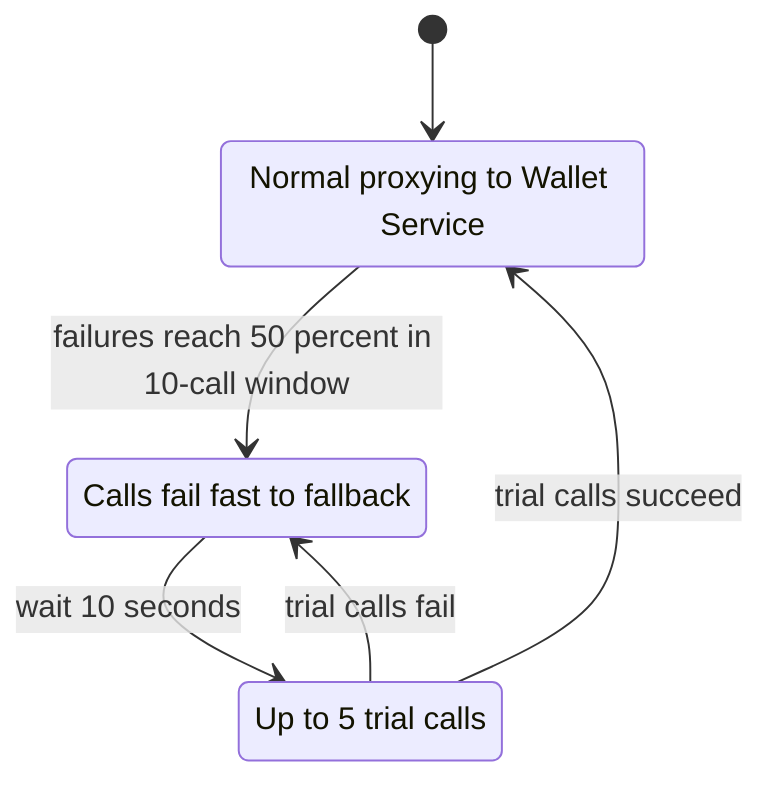

### Fallback response

When Wallet Service is unavailable, slow, or the circuit breaker is open, the gateway forwards internally to `/fallback/walletService`.

Response status:

```text
503 Service Unavailable
```

Response body:

```json
{
  "success": false,
  "message": "Wallet Service is currently degraded or experiencing high load. Please try again later.",
  "error_code": "SERVICE_UNAVAILABLE"
}
```

## 🐵 Configuration Profiles

### Base configuration: `application.yaml`

The base config imports `.env` and expects:

```text
JWT_SECRET=<base64 jwt secret>
```

`env.example` contains the supported environment variable names without secret values.

Current base service addresses:

| Property           | Current base value                           |
|--------------------|----------------------------------------------|
| Redis host         | `wallet-redis-d`                             |
| Redis port         | `6379`                                       |
| Wallet Service URI | `${WALLET_SERVICE_URL:http://localhost:8081}` |
| Gateway port       | `${SERVER_PORT:8080}`                        |


### Production configuration: `application-prod.yaml`

The production profile keeps the same logical routes but externalizes infrastructure:

| Environment variable      | Default                          | Purpose                                                  |
|---------------------------|----------------------------------|----------------------------------------------------------|
| `JWT_SECRET`              | none                             | Required Base64 secret for JWT verification.             |
| `REDIS_HOST`              | `wallet-redis-d`                 | Redis host.                                              |
| `REDIS_PORT`              | `6379`                           | Redis port.                                              |
| `REDIS_PASSWORD`          | empty                            | Redis password, if required.                             |
| `WALLET_SERVICE_URL`      | `http://wallet-service:8081`     | Wallet Service upstream URL.                             |
| `CORS_ALLOWED_ORIGINS`    | none                             | Required comma-separated browser origins for production CORS. |
| `GATEWAY_INTERNAL_SECRET` | `default-edge-secret-string-123` | Value added as `X-Gateway-Token` to downstream requests. |
| `TRUSTED_PROXY_CIDRS`     | empty                            | Trusted proxy CIDRs or IPs for `X-Forwarded-For`.        |
| `SERVER_PORT`             | `8080` by Spring Boot default    | Optional gateway port override.                          |

Production Redis SSL is enabled:

```yaml
spring:
  data:
    redis:
      ssl:
        enabled: true
```

### Configuration resolution flow

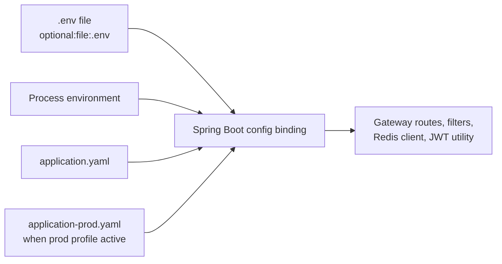

## 🐵 OpenAPI and Swagger Flow (Exposed deliberately)

The gateway hosts Swagger UI and proxies Wallet Service OpenAPI JSON through a namespaced route.

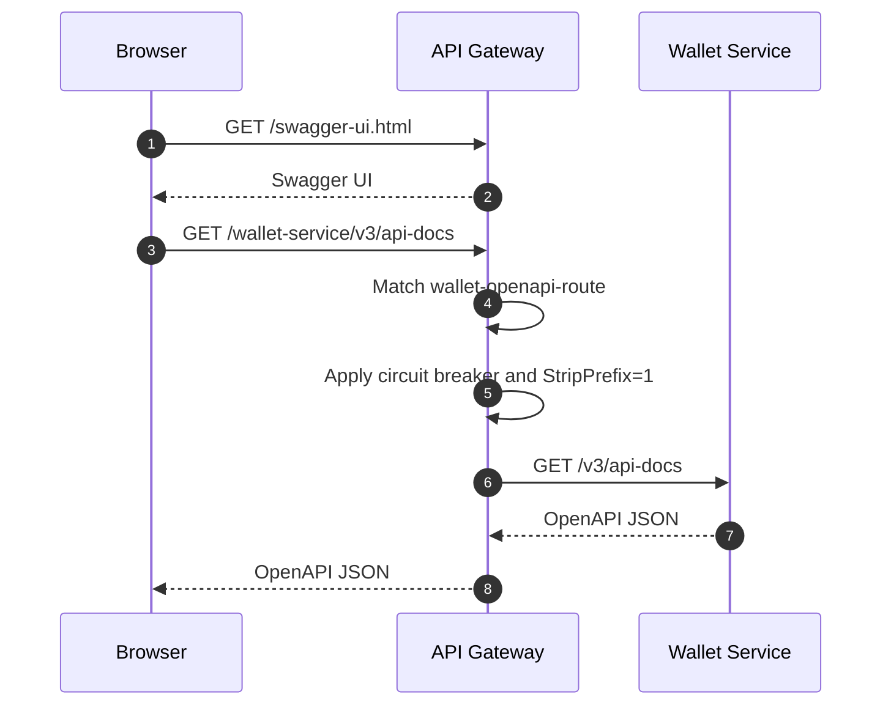

Springdoc URL config:

```yaml
springdoc:
  swagger-ui:
    path: /swagger-ui.html
    urls:
      - name: wallet-service
        url: /wallet-service/v3/api-docs
```

## 🐵 Build, Run, and Test

### Prerequisites

- Java 21
- Maven wrapper from this repository
- Redis reachable by the active config
- Wallet Service reachable by the active route URIs
- Base64 `JWT_SECRET` shared with Wallet Service

### Run tests

```bash
./mvnw test
```

The current test suite includes:

- a Spring context load test
- a pure unit test for trusted proxy and client IP resolution
- Docker-backed gateway integration tests using `WebTestClient`, `MockWebServer`, Redis, and Testcontainers

When Docker is unavailable, the Testcontainers-based integration tests are skipped intentionally through `@Testcontainers(disabledWithoutDocker = true)`.

### Build the jar

```bash
./mvnw clean package
```

Generated artifact:

```text
target/APIgateway-0.0.1-SNAPSHOT.jar
```

### Run with the base profile

```bash
JWT_SECRET=<base64-secret> \
WALLET_SERVICE_URL=http://localhost:8081 \
./mvnw spring-boot:run
```

The active base configuration points Redis to `wallet-redis-d` and Wallet Service to `${WALLET_SERVICE_URL:http://localhost:8081}`.

For direct local JVM development, override infrastructure addresses explicitly:

```bash
JWT_SECRET=<base64-secret> \
WALLET_SERVICE_URL=http://localhost:8081 \
SPRING_DATA_REDIS_HOST=localhost \
SPRING_DATA_REDIS_PORT=6379 \
./mvnw spring-boot:run
```

### Run with the production profile

```bash
SPRING_PROFILES_ACTIVE=prod \
JWT_SECRET=<base64-secret> \
REDIS_HOST=<redis-host> \
REDIS_PORT=6379 \
REDIS_PASSWORD=<redis-password-if-any> \
WALLET_SERVICE_URL=http://wallet-service:8081 \
CORS_ALLOWED_ORIGINS=https://your-frontend-domain.com \
GATEWAY_INTERNAL_SECRET=<internal-shared-secret> \
TRUSTED_PROXY_CIDRS=10.0.0.0/8,192.168.0.0/16 \
./mvnw spring-boot:run
```

### Basic smoke checks

```bash
curl http://localhost:8080/
curl http://localhost:8080/swagger-ui.html
curl http://localhost:8080/fallback/walletService
```

Expected root response shape:

```json
{
  "gateway": "Active",
  "status": "ONLINE",
  "perimeter_security": "ENABLED",
  "timestamp": "2026-01-01T00:00:00Z"
}
```

## 🐵 Docker Runtime

The Dockerfile uses a two-stage build:

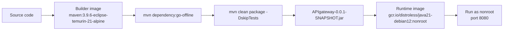

Runtime characteristics:

| Area                  | Detail                                                         |
|-----------------------|----------------------------------------------------------------|
| Runtime base          | `gcr.io/distroless/java21-debian12:nonroot`                    |
| User                  | `nonroot:nonroot`                                              |
| Exposed port          | `8080`                                                         |
| Jar path              | `/app/api-gateway.jar`                                         |
| JVM flags             | `-XX:+UseSerialGC -Xmx256m -Xss512k -XX:MaxMetaspaceSize=128m` |
| Shell/package manager | Not present in distroless runtime image                        |

Build locally:

```bash
docker build -t wallet-api-gateway:local .
```

Run locally:

```bash
docker run --rm -p 8080:8080 \
  -e SPRING_PROFILES_ACTIVE=prod \
  -e JWT_SECRET=<base64-secret> \
  -e REDIS_HOST=<redis-host> \
  -e REDIS_PORT=6379 \
  -e REDIS_PASSWORD=<redis-password-if-any> \
  -e WALLET_SERVICE_URL=http://wallet-service:8081 \
  -e CORS_ALLOWED_ORIGINS=https://your-frontend-domain.com \
  -e GATEWAY_INTERNAL_SECRET=<internal-shared-secret> \
  -e TRUSTED_PROXY_CIDRS=10.0.0.0/8 \
  wallet-api-gateway:local
```

## 🐵 CI/CD Pipeline

The GitHub Actions workflow is `.github/workflows/api-gateway-ci.yml`.

Trigger:

```text
push to production branch
```

Pipeline:

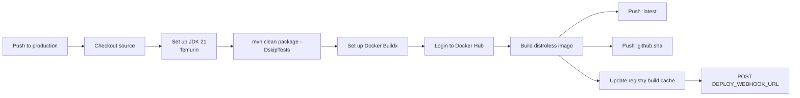

After the image push and cache update, the workflow posts to `${{ secrets.DEPLOY_WEBHOOK_URL }}` to trigger production deployment.

Published tags:

```text
${DOCKER_USERNAME}/wallet-api-gateway:latest
${DOCKER_USERNAME}/wallet-api-gateway:${github.sha}
```

## 🐵 Operational Notes

### HTTP status behavior

| Condition                          | Status | Body                        |
|------------------------------------|--------|-----------------------------|
| Missing JWT on secured route       | 401    | Empty                       |
| Invalid JWT on secured route       | 401    | Empty                       |
| Blacklisted token                  | 401    | Empty                       |
| Rate limit exceeded                | 429    | `Try again after some time` |
| Wallet Service timeout/degradation | 503    | Fallback JSON               |
| Gateway root check                 | 200    | Gateway status JSON         |

### Redis keys

| Key pattern                     | Type                                 | Owner                 | TTL                                 |
|---------------------------------|--------------------------------------|-----------------------|-------------------------------------|
| `rate_limit:<route-scope>:<ip>` | Hash with `tokens` and `last_refill` | Lua token bucket      | `ceil(capacity / rate) + 5` seconds |
| `blacklist:<token>`             | String value `revoked`               | Authentication filter | Remaining token lifetime            |

### Trust boundaries

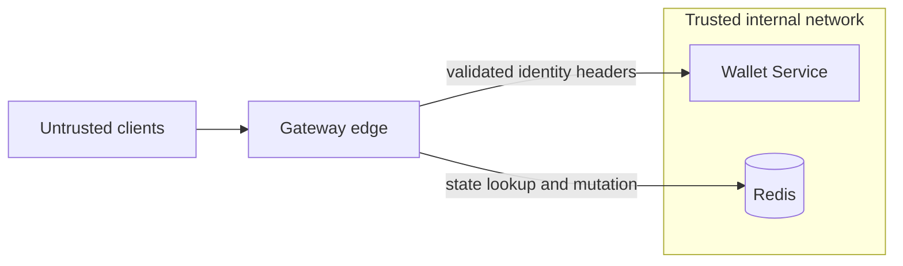

Security assumptions:

- `JWT_SECRET` is shared only between trusted services.
- Wallet Service trusts `X-User-Id` and `X-User-Role` only from the gateway path, not from public traffic.
- In production, `X-Gateway-Token` gives Wallet Service an additional way to verify that a request came through the gateway.
- `X-Forwarded-For` is used for rate-limit identity only when the immediate caller IP is listed in `application.rate-limit.trusted-proxies`; otherwise the gateway ignores the header and uses the TCP remote address.

### Dependency snapshot

| Dependency area      | Current version/source                                                                                                    |
|----------------------|---------------------------------------------------------------------------------------------------------------------------|
| Java                 | 21                                                                                                                        |
| Spring Boot parent   | 3.5.14                                                                                                                    |
| Spring Cloud BOM     | 2025.0.2                                                                                                                  |
| Spring Cloud Gateway | `spring-cloud-starter-gateway-server-webflux`                                                                             |
| Redis                | `spring-boot-starter-data-redis-reactive`                                                                                 |
| Circuit breaker      | `spring-cloud-starter-circuitbreaker-reactor-resilience4j`                                                                |
| JWT                  | `jjwt-api`, `jjwt-impl`, `jjwt-jackson` 0.13.0                                                                            |
| OpenAPI UI           | `springdoc-openapi-starter-webflux-ui` 2.8.13                                                                             |
| Actuator             | `spring-boot-starter-actuator`                                                                                            |
| Validation           | `spring-boot-starter-validation`                                                                                          |
| Tests                | `spring-boot-starter-test`, `reactor-test`, `spring-boot-testcontainers`, `testcontainers-junit-jupiter`, `mockwebserver` |

## ✔️ Next Improvements

These are practical next steps based on the current architecture:

1. Add request correlation IDs and structured logging so gateway decisions can be traced across Wallet Service logs.

## Mental Model

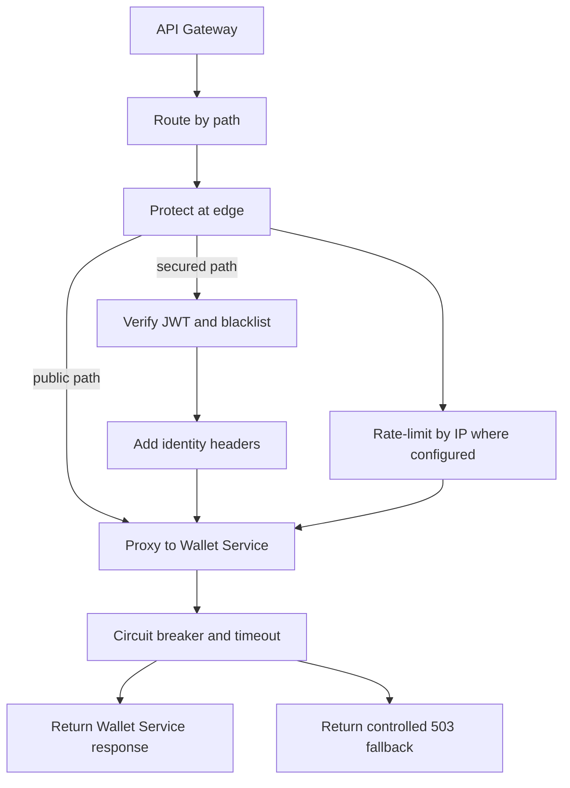

The gateway is intentionally thin on business logic. It makes edge decisions quickly, passes only trusted context downstream, and lets Wallet Service own wallet-domain behavior.
