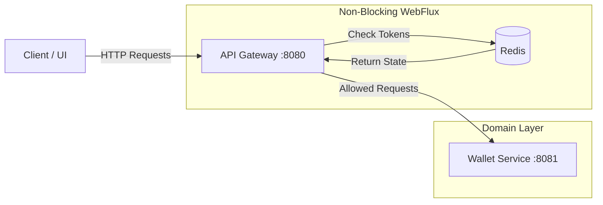

```mermaid
graph LR
    Client[Client / UI] -->|HTTP Requests| Gateway[API Gateway :8080]
    
    subgraph Edge Layer [Non-Blocking WebFlux]
        Gateway -->|Check Tokens| Redis[(Redis)]
        Redis -->|Return State| Gateway
    end
    
    subgraph Private Subnet [Domain Layer]
        Gateway -->|Allowed Requests| Wallet[Wallet Service :8081]
    end
```